# UnderDoc Tutorial - Expense Analytics using GenAI and MCP server for SQLite DB

- [UnderDoc Tutorial - Expense Analytics using GenAI and MCP server for SQLite DB](#underdoc-tutorial---expense-analytics-using-genai-and-mcp-server-for-sqlite-db)
  - [Introduction](#introduction)
  - [Overview](#overview)
  - [What is MCP](#what-is-mcp)
  - [Prerequisite](#prerequisite)
    - [Get an UnderDoc API Key](#get-an-underdoc-api-key)
      - [Step 1: Signup](#step-1-signup)
      - [Step 2: Login](#step-2-login)
      - [Step 3: Get the key from "Key Management" Page](#step-3-get-the-key-from-key-management-page)
    - [Install uv](#install-uv)
    - [Install Python 3.12](#install-python-312)
    - [Install sqlite command line interface](#install-sqlite-command-line-interface)
  - [Environment Setup](#environment-setup)
    - [Clone the project for this tutorial](#clone-the-project-for-this-tutorial)
    - [Setup Python Virtual Environment and Install Required Packages](#setup-python-virtual-environment-and-install-required-packages)
    - [Environment Verification](#environment-verification)
    - [Initialize a SQLite DB (optional)](#initialize-a-sqlite-db-optional)
    - [Copy your expense images into the folder receipt-images](#copy-your-expense-images-into-the-folder-receipt-images)
  - [Perform Data Extraction and Save to DB](#perform-data-extraction-and-save-to-db)
    - [Data Verification](#data-verification)
  - [Expense Analytics with Natural Language](#expense-analytics-with-natural-language)
    - [Install Claude Desktop](#install-claude-desktop)
    - [Clone the source of reference MCP server from Github](#clone-the-source-of-reference-mcp-server-from-github)
    - [Install MCP Server for SQLite for Claude Desktop](#install-mcp-server-for-sqlite-for-claude-desktop)
    - [Verify the MCP server in Claude Desktop](#verify-the-mcp-server-in-claude-desktop)
    - [Overview of UnderDoc Expense (SQLite) DB](#overview-of-underdoc-expense-sqlite-db)
    - [Expense Analytics by Asking Questions](#expense-analytics-by-asking-questions)
  - [Final words](#final-words)
  - [Resources](#resources)

---

## Introduction

In my previous [tutorial](https://medium.com/underdoc/expense-analytics-using-metabase-and-llm-with-receipt-invoice-images-part-1-c5ace9a8bd3c), I discussed about how to extract structure expense data from images, store it into a SQLite DB and use Metabase to perform expense analytics.

In this tutorial, I would like to discuss using GenAI and MCP server for SQLite in performing expense analytics by chatting with a LLM in natural language.

This tutorial focus on using GenAI (Claude Desktop) and MCP server for SQLite, and assume that the database was already populated with UnderDoc expense records. You can follow the previous tutorial up to the section "Perform Data Extraction and Save to DB" (skip the rest of the sections relating to Metabase). If you want to have a quick look on how the MCP server works, you can also download the sample SQLite DB with 20 sample expense records [here](https://github.com/under-doc/underdoc-tutorial-expense-analytics-mcp-sqlite/raw/refs/heads/main/underdoc.db).

You need to have the following in order to be able to run through this tutorial:

- A laptop or desktop running MacOS
- uv (a Python runtime and package manager for running the SQLite MCP server)
- git (for cloning the MCP server source code from github)
- Claude Desktop (this is the GenAI app we are using in this tutorial, which supports MCP servers)
- Sqlite DB

For those reader haven't went through the previous tutorial, I have replicated the steps here for easy reference. If you already have the SQLite DB ready, you can skip to the section ["Expense Analytics with Natural Language"](#expense-analytics-with-natural-language).

## Overview

This tutorial use the following components for various tasks:

- [UnderDoc](https://underdoc.io) for extracting data from receipt/invoice/demand-notes images
- [uv](https://github.com/astral-sh/uv) for managing Python runtime and runs the MCP servers
- [SQLite](https://sqlite.com/) for storing extracted data
- [Claude Desktop for Mac](https://claude.ai/download) for expense analytics using LLM with MCP servers

## What is MCP

There are too many articles discussing MCP (Model Context Protocol), so I will not go into details here. In short, MCP provided a standardized way for LLM to interact with various resources and tools required for answering users' questions.

There are already a numbers of tools supports MCP server, like Claude desktop, Cursor IDE, etc. Many other GenAI providers (e.g. OpenAI, Google, etc.) also announced the support of MCP in their services as well.

The open source MCP repo in Github had provided a list of [reference servers](https://github.com/modelcontextprotocol/servers). There is one for [SQLite DB](https://github.com/modelcontextprotocol/servers/tree/main/src/sqlite) integration, which will be used in this tutorial.

## Prerequisite

### Get an UnderDoc API Key

The key step in this tutorial is to extract the expense information from images into structured data (e.g. shop name, amount, currency, inferred category, etc.) that is suitable for storing into a database for exploration. We will use [UnderDoc](https://underdoc.io), which is a cost-effective platform (with a free tier) in performing this task. This tool also works well with multi-language images.

Using UnderDoc is simple, just signup at their developer portal and get an API key.

#### Step 1: Signup

First of all, visit the signup page at [UnderDoc Developer Portal](https://dev-portal.underdoc.io/signup)

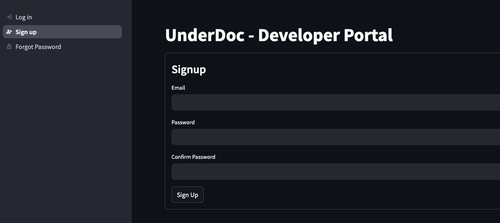

Enter your email, password and then confirm Sign Up.

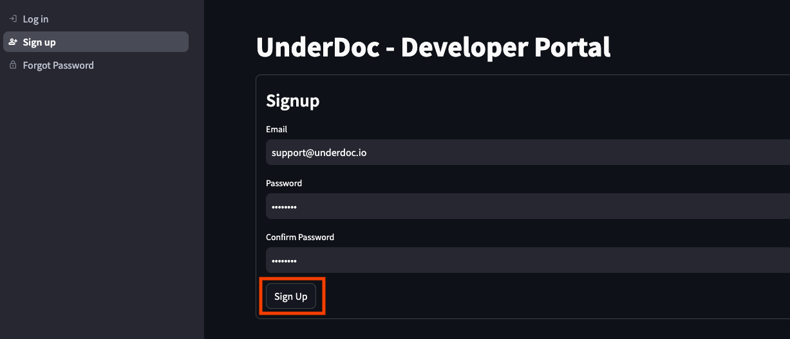

Upon sign up successful, you will receive an email. You need to verify your email before login.

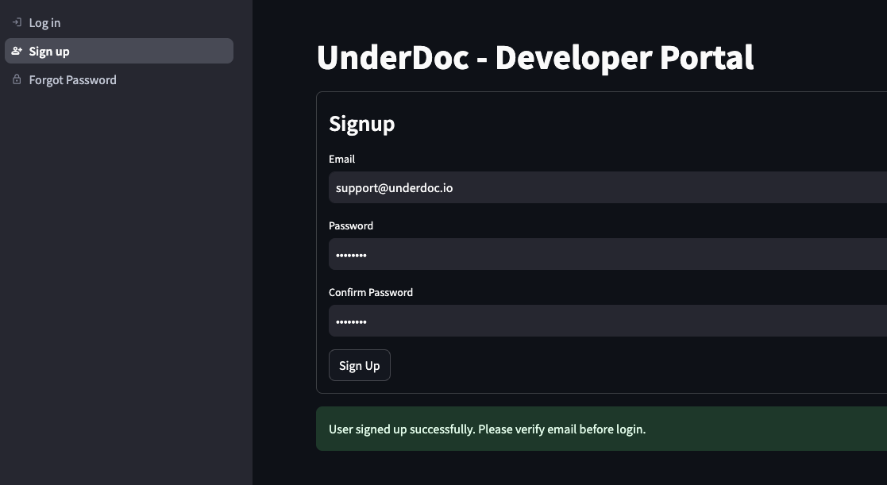

#### Step 2: Login

Once sign up success and email verified, you can then login to [UnderDoc Developer Portal](https://dev-portal.underdoc.io/) to login.

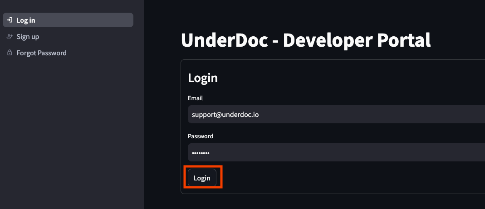

#### Step 3: Get the key from "Key Management" Page

On the left, select "Key Management".

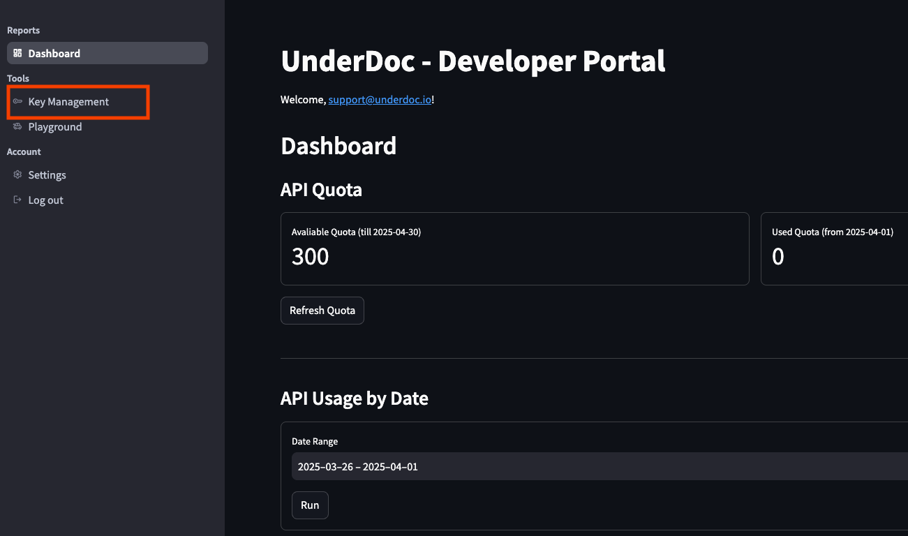

In the Key Management page, click the eye icon to display the key, and then copy it for use later in this tutorial.

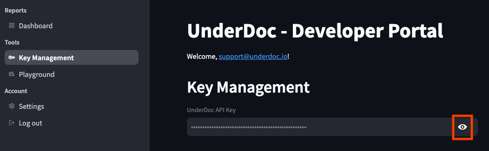

Now you have the UnderDoc API key, and can proceed to the rest of the tutorial.

### Install uv

To run the SQLite MCP server, "uv" is required. You can refer to their [site](https://docs.astral.sh/uv/getting-started/installation/) for installation instructions. The easiest way is to install it using brew:

```bash
brew install uv
```

### Install Python 3.12

This tutorial was tested with Python 3.12. To install this into your Mac, the easiest way is to install via homebrew. The following is the command.

```bash
brew install python@3.12
```

### Install sqlite command line interface

The expense data extracted will be persisted to SQLite DB locally. We will use SQLite to verify the database as well as the data stored. To install, we also use homebrew.

```bash
brew install sqlite
```

This concludes all prerequisites, let's proceed to environment setup!

## Environment Setup

### Clone the project for this tutorial

All the Python scripts required, and some sample images were provided by this tutorial. Clone it from GitHub with the following command.

```bash
git clone https://github.com/under-doc/underdoc-expense-analytics-tutorial.git
```

Once cloned, change directory into the project folder. For example, my folder is as follows:

```bash
/Users/clarenceho/workspace/underdoc/underdoc-expense-analytics-tutorial
```

In this folder, you will see some folders and files. The following is an overview:

- README.md: this file
- model.py: the Python script for model classes
- main.py: the Python script for the extraction process
- requirements.txt: the Python library packages that this project requires
- receipt-images: the expense images should be put here. You can see 20 sample images provided
- metabase-data: this is where the Metabase and UnderDoc database will be stored

### Setup Python Virtual Environment and Install Required Packages

The next step is to create a Python virtual environment for this tutorial and install the required packages. Run the following commands in order.

```bash
# Step 1: Create a Python virtual environment in the folder venv using Python 3.12
python3.12 -m venv venv

# Step 2: Activate the Python virtual environment
source venv/bin/activate

# Step 3: Install the required Python packages
pip install -r requirements.txt
```

### Environment Verification

To verify the Python environment, run the following command.

```bash
pip list
```

You should see the list like one below.

```bash
Package                   Version
------------------------- -----------
aiosignal                 1.3.2
annotated-types           0.7.0
anyio                     4.9.0
attrs                     25.3.0
boto3                     1.37.22
botocore                  1.37.22
certifi                   2025.1.31
charset-normalizer        3.4.1
click                     8.1.8
filelock                  3.18.0
frozenlist                1.5.0
h11                       0.14.0
httpcore                  1.0.7
httpx                     0.28.1
idna                      3.10
jmespath                  1.0.1
jsonschema                4.23.0
jsonschema-specifications 2024.10.1
msgpack                   1.1.0
packaging                 24.2
pip                       25.0
protobuf                  6.30.2
pydantic                  2.11.0
pydantic_core             2.33.0
pydantic-settings         2.8.1
python-dateutil           2.9.0.post0
python-dotenv             1.1.0
PyYAML                    6.0.2
ray                       2.44.1
referencing               0.36.2
requests                  2.32.3
rpds-py                   0.24.0
s3transfer                0.11.4
six                       1.17.0
sniffio                   1.3.1
SQLAlchemy                2.0.40
sqlmodel                  0.0.24
typing_extensions         4.13.0
typing-inspection         0.4.0
underdoc                  0.4.2
urllib3                   2.3.0
```

### Initialize a SQLite DB (optional)

We need to have an empty SQLite DB file for storing extracted expense data. This repo already provided one (in metabase-data/underdoc.db). If you need to initialize one, run the following command:

```bash
sqlite3 metabase-data/underdoc.db
```

### Copy your expense images into the folder receipt-images

The script will process all images in the folder receipt-images. You can use the sample images provide, or copy your own images into the folder for analysis,.

If you follow this tutorial so far, I really want to express my sincere thanks! We are now ready for extracting the data from images into the DB.

## Perform Data Extraction and Save to DB

Before running the script, setup the environment variable of your UnderDoc API key, as the script will use the key to interact with UnderDoc.

```bash
export UNDERDOC_API_KEY=<your_api_key>
```

Once you got the environment setup and ready, extract data to DB is easy. Just run the following command:

```bash
python main.py
```

The script make use of the [UnderDoc Python SDK](https://github.com/under-doc/underdoc-python-sdk) to interact with UnderDoc's Document Understanding API, to get the returned structured data, and then store it into SQLite DB. Depends on your laptops hardware, it will also try to run the extraction of multiple images in parallel.

The script will take some time to run. If successful, you will see output similar to the following.

```bash
python main.py
2025-04-01 12:38:25,873 - __main__ - INFO - UnderDoc Tutorial - Extract expense data from imagesand persist to DB
2025-04-01 12:38:25,873 - __main__ - INFO - Extracting expense data and persist to DB
2025-04-01 12:38:25,873 - __main__ - INFO - Extracting expense data from images - will take some time
2025-04-01 12:38:25,873 - underdoc.underdoc_client - INFO - UnderDoc client initialized successfully
2025-04-01 12:38:25,873 - underdoc.underdoc_client - INFO - Extracting expense data from file pattern: receipt-images/*.*, execution mode: BatchExecutionMode.Parallel
2025-04-01 12:38:27,370	INFO worker.py:1852 -- Started a local Ray instance.
2025-04-01 12:39:16,704 - underdoc.underdoc_client - INFO - Extracted 20 expense data from 20 images
2025-04-01 12:39:16,704 - __main__ - INFO - Extracted expense data from images completed successfully
2025-04-01 12:39:16,733 - __main__ - INFO - Expense data saved to DB
```

### Data Verification

To verify that the data in SQLite DB, run the following command.

```bash
sqlite3 metabase-data/underdoc.db
```

In the "sqlite>" prompt, type the following command to list the tables.

```bash
sqlite> .tables
```

You should see a table "myexpense" appear.

```bash
sqlite> .tables
myexpense
```

To list the records in the table, type the following command.

```bash
sqlite> select * from myexpense;
```

You should be able to see all expense records, similar to the following one.

```bash
sqlite> select * from myexpense;
1|2023-08-08 00:00:00.000000|Invoice|Uber||Misc|TWD|1642.0|receipt-images/expense_008.png
2|2025-01-02 00:00:00.000000|Receipt|函太郎 Tokyo店|東京都千代田区丸の内1-9-1|Food|JPY|2299.0|receipt-images/expense_020.jpg
3|2023-01-31 00:00:00.000000|Invoice|Google|70 Pasir Panjang Road, #03-71
Mapletree Business City
Singapore 117371|Google Workspace|USD|18.0|receipt-images/expense_009.png
4|2025-01-04 00:00:00.000000|Receipt|AEON|イオン新潟西店|Groceries|JPY|3923.0|receipt-images/expense_019.jpg
5|2024-07-29 00:00:00.000000|Invoice|台灣自來水股份有限公司|236新北市土城區學享街63、65號|Utilities|TWD|149.0|receipt-images/expense_018.png
6|2023-03-02 00:00:00.000000|Receipt|AXA 安盛|5/F, AXA Southside, 38 Wong Chuk Hang Road, Wong Chuk Hang, Hong Kong|Policy Premium Payment|HKD|2577.48|receipt-images/expense_001.png
7|2024-09-07 00:00:00.000000|Invoice|48.Lindberg by Puyi|Shop OT 316, Level 3, Ocean Terminal, Harbour City, Tsimshatsui, Kowloon, Hong Kong|optical|HKD|12498.0|receipt-images/expense_015.jpg
8|2021-04-27 00:00:00.000000|Receipt|深仔記|尖沙咀亞厘道29-39號
九龍中心地下A舖|Food|HKD|39.0|receipt-images/expense_014.png
9|2022-10-21 00:00:00.000000|Invoice|中華電信|台北營運處|Telecommunication|TWD|588.0|receipt-images/expense_002.png
10|2021-05-27 00:00:00.000000|Receipt|OUTBACK STEAKHOUSE|Shop 304, 3/F,Silvercord
Tsim Sha Tsui, Kowloon.|food|HKD|78.0|receipt-images/expense_016.png
11|2023-03-23 00:00:00.000000|Invoice|新加坡商蝦皮娛樂電商有限公司台灣分公司|台灣分公司|Electronics|TWD|3990.0|receipt-images/expense_017.png
12|2025-03-04 00:00:00.000000|Receipt|namecheap|4600 East Washington Street. Suite 305, Phoenix, AZ 85034 USA|web services|USD|47.88|receipt-images/expense_003.png
13|2023-07-29 00:00:00.000000|Invoice|CLP|DIAMOND HILL KOWLOON|Electricity|HKD|903.0|receipt-images/expense_007.png
14|2024-12-18 00:00:00.000000|Invoice|RATING AND VALUATION DEPARTMENT||Misc|HKD|3130.0|receipt-images/expense_013.png
15|2023-05-02 00:00:00.000000|Invoice|Manning Publications Co.|20 Baldwin Road Shelter Island, NY 11964|Books|USD|26.39|receipt-images/expense_012.png
16|2021-08-25 00:00:00.000000|Invoice|香港寬頻 HONG KONG BROADBAND NETWORK||Misc|HKD|282.0|receipt-images/expense_006.png
17|2021-08-09 00:00:00.000000|Invoice|Water Supplies Department|FLAT H, 30/F, BLOCK 1
GRAND VIEW GARDEN
DIAMOND HILL, KOWLOON|Water bill|HKD|287.8|receipt-images/expense_010.png
18|2025-01-06 00:00:00.000000|Receipt|NIPPON Rent-A-Car|越後湯沢営業所|rental car|JPY|46750.0|receipt-images/expense_004.jpg
19|2021-09-29 00:00:00.000000|Receipt|潮發大藥房|九龍九龍城衙前圍道88號地下|Medicine|HKD|515.0|receipt-images/expense_005.png
20|2022-09-14 00:00:00.000000|Invoice|Apple||Cloud Storage|TWD|90.0|receipt-images/expense_011.png
```

As you can see, the sample images provided include English, Chinese and Japanese. You can also see the source image file for each record.

## Expense Analytics with Natural Language

Now we have the expense data from our receipt/invoice images extracted and stored in the database, now we can use Claude Desktop and MCP server for SQLite to perform analytics.

First of all, we need to install Claude Desktop (if you did not use it before).

### Install Claude Desktop

Follow the instructions in [Anthropic's website](https://claude.ai/download) to download and install Claude desktop. Then sign up an account if required.

### Clone the source of reference MCP server from Github

At the moment of writing, using the reference MCP server for SQLite DB requires cloning the source code from their Github repo.

```bash
git clone https://github.com/modelcontextprotocol/servers.git
```

Upon cloning, the source for the MCP server for SQLite is in the subfolder "servers/src/sqlite". You can refer to their README file for the MCP server's features and installation instructions.

### Install MCP Server for SQLite for Claude Desktop

To install a MCP server for Claude Desktop, you need to edit the app's config file. For Mac, the location is:

```bash
~/Library/Application Support/Claude/claude_desktop_config.json
```

Use any editor, open the file and add the following snippet into the file:

```json
"mcpServers": {
  "sqlite": {
    "command": "uv",
    "args": [
      "--directory",
      "<parent_of_servers_repo>/servers/src/sqlite",
      "run",
      "mcp-server-sqlite",
      "--db-path",
      "<underdoc_db_file_path>"
    ]
  }
}
```

If you already installed MCP server before, you just need to append the "sqlite" part into the "mcpServers" section.

Remember to replace the placeholder:

- <parent_of_servers_repo>: the folder where you cloned the MCP server source code
- <underdoc_db_file_path>: the path to your underdoc.db file

For example, in my environment, the snippet is as follows:

```json
"mcpServers": {
  "sqlite": {
    "command": "uv",
    "args": [
      "--directory",
      "/Users/clarenceho/workspace/mcp/servers/src/sqlite",
      "run",
      "mcp-server-sqlite",
      "--db-path",
      "/Users/clarenceho/workspace/underdoc/sqlite/underdoc.db"
    ]
  }
}
```

Upon modification, restart Claude Desktop.

Note: uv (you will notice that it's the command to start the MCP server) also need access to the folders ~/.local/share/uv and ~/.local/share/python. In my case, at the first time I start Claude Desktop after installing the MCP server, I got error like "Permission denied to folder ~/.local/share/uv". If you got the same error, create the folders and grant permission to yourself. For example, in my case:

```bash
sudo mkdir ~/.local/share/uv
sudo mkdir ~/.local/share/python
sudo chown <your-username> ~/.local/share/uv
sudo chown <your-username> ~/.local/share/python
```

### Verify the MCP server in Claude Desktop

Let's verify that the MCP server for SQLite was installed successfully for Claude.

In Claude's main chat windows, you will see a list of icon buttons. Click the "MCP Tools icon" as highlighted in the diagram.

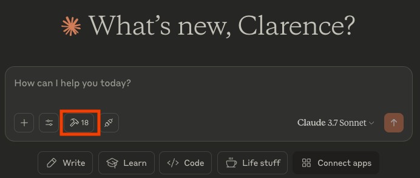

A dialog box will pop up which displays the list of MCP tools (provided by the configured MCP servers) available for it's LLM to invkoe. The following screenshot is an example:

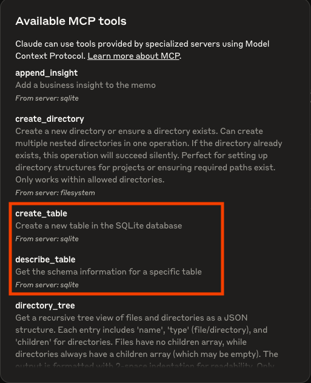

I highlighted 2 of the tools provided by SQLite server. Those are function calls that LLM can use to retrieve information and data from the SQLite DB. Because the MCP server's config include the UnderDoc DB file, Claude will be able to reveal the schema and data of the expense table and data. The full list of tools provided by SQLite MCP server can be found [here](https://github.com/modelcontextprotocol/servers/tree/main/src/sqlite). Seeing the tools in this dialog box means that you installed the SQLite MCP server to Claude successfully.

You also see other tools in the screenshot as I also installed the ["filesystem" reference server](https://github.com/modelcontextprotocol/servers/tree/main/src/filesystem).

### Overview of UnderDoc Expense (SQLite) DB

Let's start with the following query to ask Claude to take a look at the SQLite DB:

```bash
Show me the tables in the sqlite db
```

After you submit the query, Claude figured out that it can use the SQLite MCP server's "list_tables" tool to answer my question. For safety purpose, it will ask for your permission to run the tools.

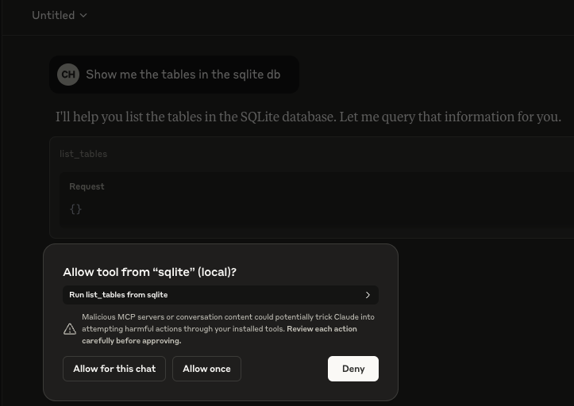

Click "Allow for this chat" to let Claude runs the tool.

Claude will run the tool and response that it found 1 table "myexpense", and ask if you want it to dscribe it's structure.

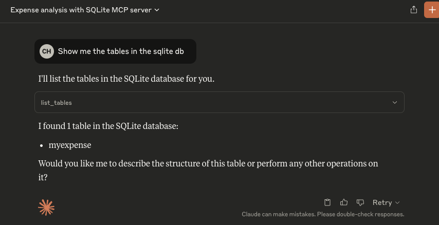

You can also expand the tool calling drop-down to see the detail request and response between Claude and the SQLite MCP server.

Type "yes" to continue. Claude will then call the appropriate tool in the SQLite MCP Server and displays the schema of the "myexpense" table in the UnderDoc expense DB in a table format.

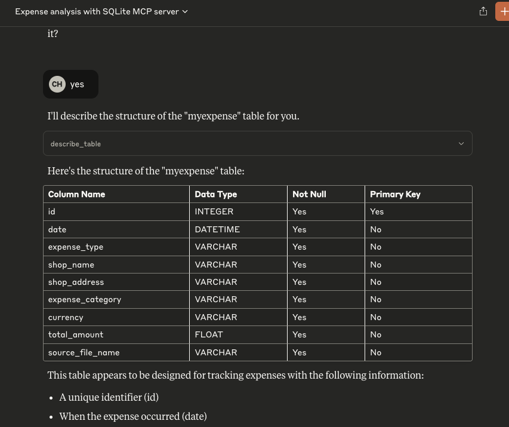

### Expense Analytics by Asking Questions

Now we can ask questions about the expenses. For example, I would like to see the distribution of my expense among different categories and currencies. Submit the following query.

```bash
Show me the total amount of expense by category, by currency
```

Claude will identify the right tool in SQLite MCP server (in this case read_query) and list the data in table format.

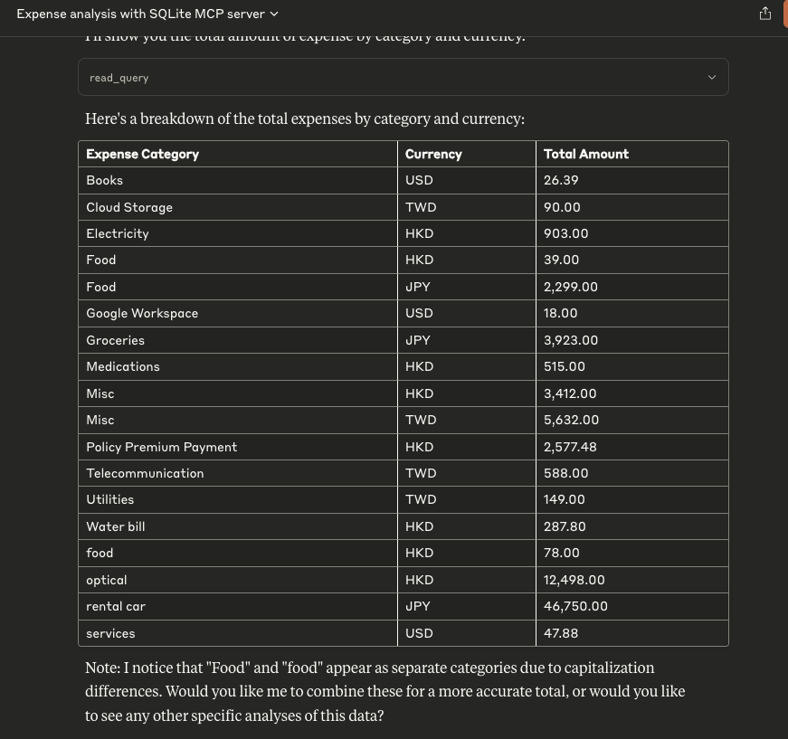

Claude is also smart enought to notice that there are 2 categories ("Food" and "food") that are similar and ask if you want to combine them. Answer yes and Claude will submit another query to merge the 2 categories and re-display the data.

Now let's ask Claude to display the data in chart format. Submit the following query.

```bash
Show me the result in a multi-line chart
```

Claude will then generate the necessary code and run it, and shows the chart. When you mouse over a particular category, it will show the amount in ecah currency. Feel free to interact with Claude to adjust the chart (e.g. change the scale of the amount in the y-axis to make it easier to read).

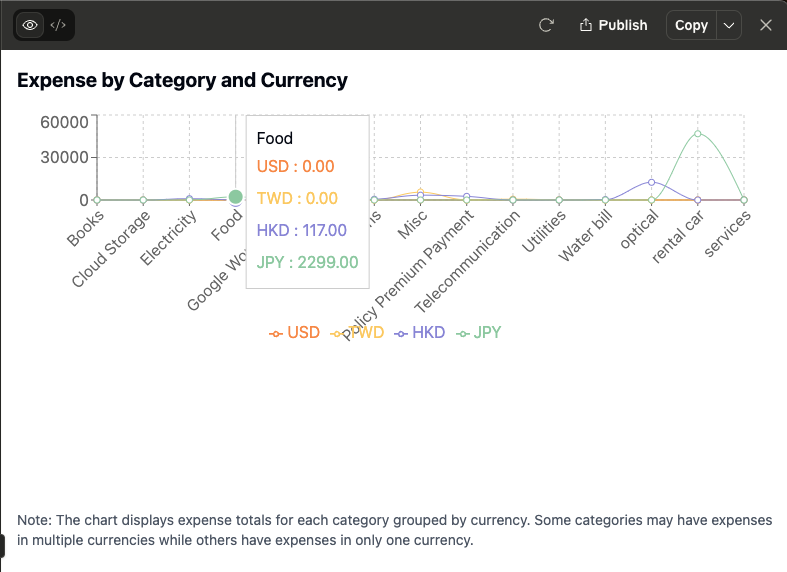

The expenses cover multiple currencies (USD, TWD, JPY, HKD), and suppose I want to convert the amount of all expenses to my base currency for an unified overview. Type in the following query.

```bash
Convert all expense amount to HKD currency
```

Claude is smart enough to query the web for the latest exchange rates from other currencies to HKD, rerun the query and generate the new chart. The following is what I got.

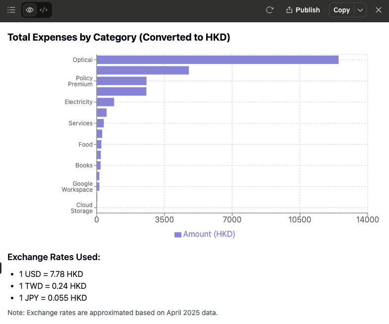

You can continue to ask Claude to fine tune the chart (e.g. change the axis, color, etc.) or filter expense for a particular period, and perform analytics of your expenses without any tool (e.g. Metabase) and SQL knowledge!

## Final words

I hope you will find this tutorial interesting and helpful. If you have any comments or questions, please feel free to contact me (<clarence@underdoc.io>) and I am very happy to answer!

## Resources

- [Expense Analytics using Metabase and LLM with receipt/invoice images (Part 1)](https://medium.com/underdoc/expense-analytics-using-metabase-and-llm-with-receipt-invoice-images-part-1-c5ace9a8bd3c)
