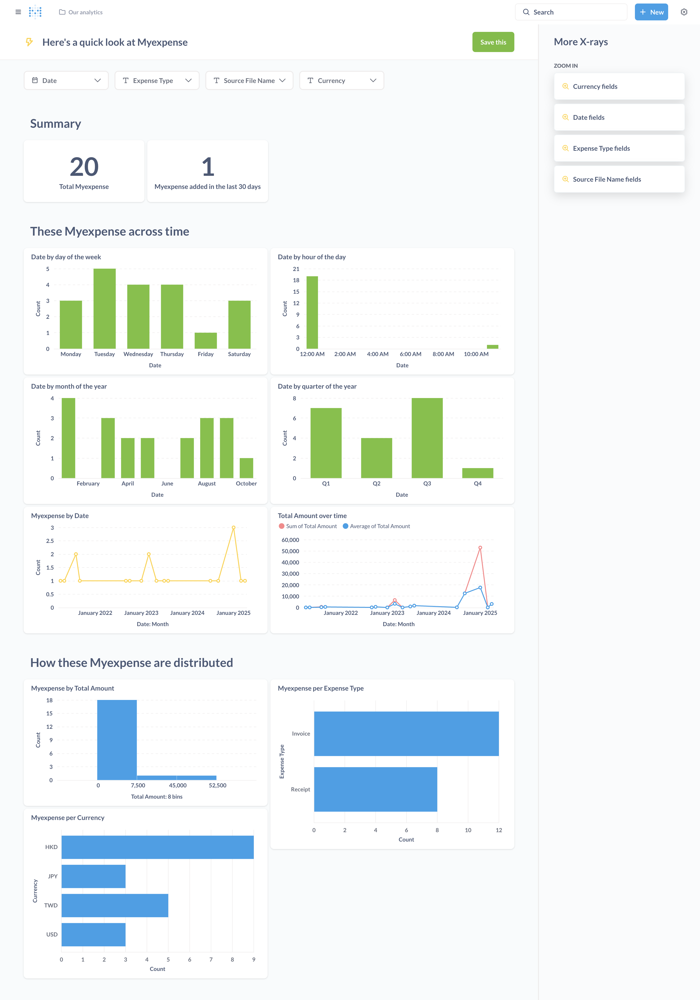

# UnderDoc Tutorial - Expense Analytics using GenAI and MCP server for SQLite DB

- [UnderDoc Tutorial - Expense Analytics using GenAI and MCP server for SQLite DB](#underdoc-tutorial---expense-analytics-using-genai-and-mcp-server-for-sqlite-db)
  - [Introduction](#introduction)
  - [Overview](#overview)
  - [Prerequisite](#prerequisite)
    - [Get an UnderDoc API Key](#get-an-underdoc-api-key)
      - [Step 1: Signup](#step-1-signup)
      - [Step 2: Login](#step-2-login)
      - [Step 3: Get the key from "Key Management" Page](#step-3-get-the-key-from-key-management-page)
    - [Install Docker](#install-docker)
    - [Install Python 3.12](#install-python-312)
    - [Install sqlite command line interface](#install-sqlite-command-line-interface)
  - [Environment Setup](#environment-setup)
    - [Clone the project for this tutorial](#clone-the-project-for-this-tutorial)
    - [Setup Python Virtual Environment and Install Required Packages](#setup-python-virtual-environment-and-install-required-packages)
    - [Environment Verification](#environment-verification)
    - [Initialize a SQLite DB (optional)](#initialize-a-sqlite-db-optional)
    - [Copy your expense images into the folder receipt-images](#copy-your-expense-images-into-the-folder-receipt-images)
  - [Perform Data Extraction and Save to DB](#perform-data-extraction-and-save-to-db)
    - [Data Verification](#data-verification)
  - [Expense Analytics](#expense-analytics)
    - [Run Metabase Docker Container](#run-metabase-docker-container)
    - [Visit Metabase for the First Time from Web Browser](#visit-metabase-for-the-first-time-from-web-browser)
    - [Connect to UnderDoc SQLite DB](#connect-to-underdoc-sqlite-db)
    - [Overview of Expense Data](#overview-of-expense-data)
    - [Expense Analytics like a Pro](#expense-analytics-like-a-pro)
  - [Python Code Explanation](#python-code-explanation)
    - [model.py](#modelpy)
    - [main.py](#mainpy)
  - [Resources](#resources)

---

## Introduction

In my previous [tutorial](https://medium.com/underdoc/expense-analytics-using-metabase-and-llm-with-receipt-invoice-images-part-1-c5ace9a8bd3c), I discussed about how to extract strucured expense data from images, store it into a SQLite DB and use Metabase to perform expense analytics.

In this tutorial, I would like to discuss using GenAI and MCP server for SQLite in performing expense analytics by chating with a LLM in natural language.

This tutorial focus on using GenAI (Claude Desktop) and MCP server for SQLite, and assume that the database was already populated with UnderDoc expense records. You can follow the previous tutorial up to the section "Perform Data Extraction and Save to DB". Of you want to have a quick look on how the MCP server works, you can also download the sample SQLite DB with 20 sample expense records [here](). Save the file "underdoc

Do you have a bunch of receipts (or invoice, demand-notes, etc.) from various sources (e.g. photo of paper receipts, screen cap from PDF, email, etc.) and want to perform the following analytical activities?

- Have a tool that can extract the data and infer the expense category for you
- Your receipts contains multi-language contents (e.g. Chinese, Japanese, etc.), and various currencies
- Save those data into a database for exploration and analytics
- Group the expenses by various criterias (e.g. month, expense category, currency, etc.) and visualize it with charts

If the above is what you want to do, then this tutorial is for you!

This is a step-by-step tutorial to guide you through the process of extracting data from expense images, persist it into a local database, and analyze it with charts by dynamic criteria.

You need to have the following in order to be able to run through this tutorial:

- A laptop or desktop running MacOS
- Python (3.12 or above)
- Docker (for running Metabase)
- Sqlite DB

This tutorial tries to make the process as simple as possible, and suitable for users with less technical experience.

## Overview

This tutorial use the following components for various tasks:

- [UnderDoc](https://underdoc.io) for extracting data from receipt/invoice/demand-notes images
- [SQLite](https://sqlite.com/) for storing extracted data
- [Metabase](https://www.metabase.com/) for expense analytics

## Prerequisite

### Get an UnderDoc API Key

The key step in this tutorial is to extract the expense information from images into structured data (e.g. shop name, amount, currency, inferred category, etc.) that is suitable for storing into a database for exploration. We will use [UnderDoc](https://underdoc.io), which is a cost-effective platform (with a free tier) in performing this task. This tool also works well with multi-language images.

Using UnderDoc is simple, just signup at their developer portal and get an API key.

#### Step 1: Signup

First of all, visit the signup page at [UnderDoc Developer Portal](https://dev-portal.underdoc.io/signup)


Enter your email, password and then confirm Sign Up.


Upon sign up successful, you will receive an email. You need to verify your email before login.


#### Step 2: Login

Once sign up success and email verified, you can then login to [UnderDoc Developer Portal](https://dev-portal.underdoc.io/) to login.


#### Step 3: Get the key from "Key Management" Page

On the left, select "Key Management".


In the Key Management page, click the eye icon to display the key, and then copy it for use later in this tutorial.


Now you have the UnderDoc API key, and can proceed to the rest of the tutorial.

### Install Docker

In this tutorial, we will use Docker to run Metabase, which is a powerful open source data analytics platform. The easiest way to have Docker in your machine is to download Docker Desktop from [Docker](https://docker.com) and install it (free for personal use).

### Install Python 3.12

This tutorial was tested with Python 3.12. To install this into your Mac, the easiest way is to install via homebrew. The following is the command.

```bash
brew install python@3.12
```

### Install sqlite command line interface

The expense data extracted will be persisted to SQLite DB locally. We will use SQLite to verify the database as well as the data stored. To install, we also use homebrew.

```bash
brew install sqlite
```

This concludes all prerequisites, let's proceed to environment setup!

## Environment Setup

### Clone the project for this tutorial

All the Python scripts required, and some sample images were provided by this tutorial. Clone it from GitHub with the following command.

```bash
git clone https://github.com/under-doc/underdoc-expense-analytics-tutorial.git
```

Once cloned, change directory into the project folder. For example, my folder is as follows:

```bash
/Users/clarenceho/workspace/underdoc/underdoc-expense-analytics-tutorial
```

In this folder, you will see some folders and files. The following is an overview:

- README.md: this file
- model.py: the Python script for model classes
- main.py: the Python script for the extraction process
- requirements.txt: the Python library packages that this project requires
- receipt-images: the expense images should be put here. You can see 20 sample images provided
- metabase-data: this is where the Metabase and UnderDoc database will be stored

### Setup Python Virtual Environment and Install Required Packages

The next step is to create a Python virtual environment for this tutorial and install the required packages. Run the following commands in order.

```bash
# Step 1: Create a Python virtual environment in the folder venv using Python 3.12
python3.12 -m venv venv

# Step 2: Activate the Python virtual environment
source venv/bin/activate

# Step 3: Install the required Python packages
pip install -r requirements.txt
```

### Environment Verification

To verify the Python environment, run the following command.

```bash
pip list
```

You should see the list like one below.

```bash
Package                   Version
------------------------- -----------
aiosignal                 1.3.2
annotated-types           0.7.0
anyio                     4.9.0
attrs                     25.3.0
boto3                     1.37.22
botocore                  1.37.22
certifi                   2025.1.31
charset-normalizer        3.4.1
click                     8.1.8
filelock                  3.18.0
frozenlist                1.5.0
h11                       0.14.0
httpcore                  1.0.7
httpx                     0.28.1
idna                      3.10
jmespath                  1.0.1
jsonschema                4.23.0
jsonschema-specifications 2024.10.1
msgpack                   1.1.0
packaging                 24.2
pip                       25.0
protobuf                  6.30.2
pydantic                  2.11.0
pydantic_core             2.33.0
pydantic-settings         2.8.1
python-dateutil           2.9.0.post0
python-dotenv             1.1.0
PyYAML                    6.0.2
ray                       2.44.1
referencing               0.36.2
requests                  2.32.3
rpds-py                   0.24.0
s3transfer                0.11.4
six                       1.17.0
sniffio                   1.3.1
SQLAlchemy                2.0.40
sqlmodel                  0.0.24
typing_extensions         4.13.0
typing-inspection         0.4.0
underdoc                  0.4.2
urllib3                   2.3.0
```

### Initialize a SQLite DB (optional)

We need to have an empty SQLite DB file for storing extracted expense data. This repo already provided one (in metabase-data/underdoc.db). If you need to initialize one, run the following command:

```bash
sqlite3 metabase-data/underdoc.db
```

### Copy your expense images into the folder receipt-images

The script will process all images in the folder receipt-images. You can use the sample images provide, or copy your own images into the folder for analysis,.

If you follow this tutorial so far, I really want to express my sincere thanks! We are now ready for extracting the data from images into the DB.

## Perform Data Extraction and Save to DB

Before running the script, setup the environment variable of your UnderDoc API key, as the script will use the key to interact with UnderDoc.

```bash
export UNDERDOC_API_KEY=<your_api_key>
```

Once you got the environment setup and ready, extract data to DB is easy. Just run the following command:

```bash
python main.py
```

The script make use of the [UnderDoc Python SDK](https://github.com/under-doc/underdoc-python-sdk) to interact with UnderDoc's Document Understanding API, to get the returned structured data, and then store it into SQLite DB. Depends on your laptops hardware, it will also try to run the extraction of multiple images in parallel.

The script will take some time to run. If successful, you will see output similar to the following.

```bash
python main.py
2025-04-01 12:38:25,873 - __main__ - INFO - UnderDoc Tutorial - Extract expense data from imagesand persist to DB
2025-04-01 12:38:25,873 - __main__ - INFO - Extracting expense data and persist to DB
2025-04-01 12:38:25,873 - __main__ - INFO - Extracting expense data from images - will take some time
2025-04-01 12:38:25,873 - underdoc.underdoc_client - INFO - UnderDoc client initialized successfully
2025-04-01 12:38:25,873 - underdoc.underdoc_client - INFO - Extracting expense data from file pattern: receipt-images/*.*, execution mode: BatchExecutionMode.Parallel
2025-04-01 12:38:27,370	INFO worker.py:1852 -- Started a local Ray instance.
2025-04-01 12:39:16,704 - underdoc.underdoc_client - INFO - Extracted 20 expense data from 20 images
2025-04-01 12:39:16,704 - __main__ - INFO - Extracted expense data from images completed successfully
2025-04-01 12:39:16,733 - __main__ - INFO - Expense data saved to DB
```

### Data Verification

To verify that the data in SQLite DB, run the following command.

```bash
sqlite3 metabase-data/underdoc.db
```

In the "sqlite>" prompt, type the following command to list the tables.

```bash
sqlite> .tables
```

You should see a table "myexpense" appear.

```bash
sqlite> .tables
myexpense
```

To list the records in the table, type the following command.

```bash
sqlite> select * from myexpense;
```

You should be able to see all expense records, similar to the following one.

```bash
sqlite> select * from myexpense;
1|2023-08-08 00:00:00.000000|Invoice|Uber||Misc|TWD|1642.0|receipt-images/expense_008.png
2|2025-01-02 00:00:00.000000|Receipt|函太郎 Tokyo店|東京都千代田区丸の内1-9-1|Food|JPY|2299.0|receipt-images/expense_020.jpg
3|2023-01-31 00:00:00.000000|Invoice|Google|70 Pasir Panjang Road, #03-71
Mapletree Business City
Singapore 117371|Google Workspace|USD|18.0|receipt-images/expense_009.png
4|2025-01-04 00:00:00.000000|Receipt|AEON|イオン新潟西店|Groceries|JPY|3923.0|receipt-images/expense_019.jpg
5|2024-07-29 00:00:00.000000|Invoice|台灣自來水股份有限公司|236新北市土城區學享街63、65號|Utilities|TWD|149.0|receipt-images/expense_018.png
6|2023-03-02 00:00:00.000000|Receipt|AXA 安盛|5/F, AXA Southside, 38 Wong Chuk Hang Road, Wong Chuk Hang, Hong Kong|Policy Premium Payment|HKD|2577.48|receipt-images/expense_001.png
7|2024-09-07 00:00:00.000000|Invoice|48.Lindberg by Puyi|Shop OT 316, Level 3, Ocean Terminal, Harbour City, Tsimshatsui, Kowloon, Hong Kong|optical|HKD|12498.0|receipt-images/expense_015.jpg
8|2021-04-27 00:00:00.000000|Receipt|深仔記|尖沙咀亞厘道29-39號
九龍中心地下A舖|Food|HKD|39.0|receipt-images/expense_014.png
9|2022-10-21 00:00:00.000000|Invoice|中華電信|台北營運處|Telecommunication|TWD|588.0|receipt-images/expense_002.png
10|2021-05-27 00:00:00.000000|Receipt|OUTBACK STEAKHOUSE|Shop 304, 3/F,Silvercord
Tsim Sha Tsui, Kowloon.|food|HKD|78.0|receipt-images/expense_016.png
11|2023-03-23 00:00:00.000000|Invoice|新加坡商蝦皮娛樂電商有限公司台灣分公司|台灣分公司|Electronics|TWD|3990.0|receipt-images/expense_017.png
12|2025-03-04 00:00:00.000000|Receipt|namecheap|4600 East Washington Street. Suite 305, Phoenix, AZ 85034 USA|web services|USD|47.88|receipt-images/expense_003.png
13|2023-07-29 00:00:00.000000|Invoice|CLP|DIAMOND HILL KOWLOON|Electricity|HKD|903.0|receipt-images/expense_007.png
14|2024-12-18 00:00:00.000000|Invoice|RATING AND VALUATION DEPARTMENT||Misc|HKD|3130.0|receipt-images/expense_013.png
15|2023-05-02 00:00:00.000000|Invoice|Manning Publications Co.|20 Baldwin Road Shelter Island, NY 11964|Books|USD|26.39|receipt-images/expense_012.png
16|2021-08-25 00:00:00.000000|Invoice|香港寬頻 HONG KONG BROADBAND NETWORK||Misc|HKD|282.0|receipt-images/expense_006.png
17|2021-08-09 00:00:00.000000|Invoice|Water Supplies Department|FLAT H, 30/F, BLOCK 1
GRAND VIEW GARDEN
DIAMOND HILL, KOWLOON|Water bill|HKD|287.8|receipt-images/expense_010.png
18|2025-01-06 00:00:00.000000|Receipt|NIPPON Rent-A-Car|越後湯沢営業所|rental car|JPY|46750.0|receipt-images/expense_004.jpg
19|2021-09-29 00:00:00.000000|Receipt|潮發大藥房|九龍九龍城衙前圍道88號地下|Medicine|HKD|515.0|receipt-images/expense_005.png
20|2022-09-14 00:00:00.000000|Invoice|Apple||Cloud Storage|TWD|90.0|receipt-images/expense_011.png
```

As you can see, the sample images provided include English, Chinese and Japanese. You can also see the source image file for each record.

## Expense Analytics

Now we have the expense data from our receipt/invoice images extracted and stored in the database, now we can use Metabase to perform analytics.

First of all, we use Docker to run an instance of Metabase.

### Run Metabase Docker Container

Verify that you have Docker installed.

```bash
docker --version
```

You should see something like below:

```bash
docker --version
Docker version 28.0.1, build 068a01e
```

We can then start Metabase with the following command.

```bash
docker run -d -p 3000:3000 \
  -v <your-project-folder>/metabase-data:/metabase-data \
  -e "MB_DB_FILE=/metabase-data/metabase.db" \
  --name metabase metabase/metabase
```

Replace <your-project-folder> with the folder of your project. For example, my project location is:

```bash
/Users/clarenceho/workspace/underdoc/underdoc-expense-analytics-tutorial/metabase-data

# I replace /Users/clarenceho with ~, which means user's home folder
~/workspace/underdoc/underdoc-expense-analytics-tutorial/metabase-data
```

Then the command for me is below.

```bash
docker run -d -p 3000:3000 \
  -v ~/workspace/underdoc/underdoc-expense-analytics-tutorial/metabase-data:/metabase-data \
  -e "MB_DB_FILE=/metabase-data/metabase.db" \
  --name metabase metabase/metabase
```

Let's breakdown the command into more details:

- Run the container in daemon mode (the -d option)
- Expose the port 3000 from the container (so your browser can connect to Metabase)
- Mount the local folder "~/workspace/underdoc/underdoc-expense-analytics-tutorial/metabase-data" to the container's folder "metabase-data", which is Metabase DB folder. By doing this you can retain your Metabase setting when you run your container next time, and also able to access the expense SQLite DB, which is also reside in the folder (the -v option)
- Pass the environment variable MB_DB_FILE, which is used by Metabase to identify the database file location. By default, Metabase use H2 database, and the file will be stored in the /metabase-data sub-folder as well
- Give the container a name "metabase", so that you can restart it by running "docker start metabase" (the --name option)
- The image to pull from Docker hub is "metabase/metabase". Docker will pull the image on the first time it runs

You can verify whether the container is running by running the following command.

```bash
docker ps
```

You should see something similar to the following.

```bash
docker ps
CONTAINER ID   IMAGE               COMMAND                  CREATED              STATUS              PORTS                    NAMES
27d0ceffb29a   metabase/metabase   "/app/run_metabase.sh"   About a minute ago   Up About a minute   0.0.0.0:3000->3000/tcp   metabase
```

You can also refer to the Docker container's log to see if the container is up and running.

```bash
docker logs -f metabase
```

You should see something similar to below.

```bash
2025-04-01 09:28:36,326 INFO sync.analyze :: classify-tables Analyzed [*****************************************·········] 😊   84% Table 5 ''PUBLIC.FEEDBACK''
2025-04-01 09:28:36,326 INFO sync.analyze :: classify-tables Analyzed [***********************************************···] 😎   96% Table 8 ''PUBLIC.INVOICES''
2025-04-01 09:28:36,333 INFO sync.util :: FINISHED: step ''classify-tables'' for h2 Database 1 ''Sample Database'' (23.0 ms)
2025-04-01 09:28:36,342 INFO sync.util :: FINISHED: Analyze data for h2 Database 1 ''Sample Database'' (120.3 ms)
2025-04-01 09:28:36,342 INFO sync.util :: STARTING: Cache field values in h2 Database 1 ''Sample Database''
2025-04-01 09:28:36,345 INFO sync.util :: STARTING: step ''delete-expired-advanced-field-values'' for h2 Database 1 ''Sample Database''
2025-04-01 09:28:36,594 INFO sync.util :: FINISHED: step ''delete-expired-advanced-field-values'' for h2 Database 1 ''Sample Database'' (248.2 ms)
2025-04-01 09:28:36,595 INFO sync.util :: STARTING: step ''update-field-values'' for h2 Database 1 ''Sample Database''
2025-04-01 09:28:37,765 INFO models.field-values :: Field BODY was previously automatically set to show a list widget, but now has 231 values. Switching Field to use a search widget instead.
2025-04-01 09:28:38,546 INFO sync.util :: FINISHED: step ''update-field-values'' for h2 Database 1 ''Sample Database'' (1.9 s)
2025-04-01 09:28:38,553 INFO sync.util :: FINISHED: Cache field values in h2 Database 1 ''Sample Database'' (2.2 s)
2025-04-01 09:28:38,555 INFO sync.util :: FINISHED: Sync h2 Database 1 ''Sample Database'' (3.6 s)
2025-04-01 09:28:38,564 INFO notification.seed :: Seeding default notifications
2025-04-01 09:28:38,665 INFO notification.seed :: Seeded notifications: {:create 3}
2025-04-01 09:28:38,671 INFO core.QuartzScheduler :: Scheduler MetabaseScheduler_$_27d0ceffb29a1743499714537 started.
2025-04-01 09:28:38,672 INFO metabase.task :: Task scheduler started
2025-04-01 09:28:38,683 INFO core.core :: Metabase Initialization COMPLETE in 29.1 s
2025-04-01 09:28:38,772 INFO task.refresh-slack-channel-user-cache :: Slack is not configured, not refreshing slack user/channel cache.
```

### Visit Metabase for the First Time from Web Browser

Open a Web Browser, and visit http://localhost:3000.

You should see the getting start page.


Click "Let's get started" to proceed to setup Metabase.

The next page is a few setup questions. The first one is language, choose the one you want and click next.


In next page, enter the corresponding information.


In the next page, choose the option you want.


### Connect to UnderDoc SQLite DB

The next step is add data, we can add our expense SQLite DB connection here.

Firstly, click the "Show more options" button to see more database types.


Select the database type "SQLite".


In the next page, enter the SQLite DB information. For display name, enter "MyExpense". For filename, enter "/metabase-data/underdoc.db" which is the SQLite DB file we use, and was mounted to the Metabase's container. The following shows the screen shot.


Click "Connect database" to connect.

In the last page, click "Finish".


In the last page, click "Take me to Metabase".


You will then able to see the home page of Metabase, include the "Myexpense" database that contains my expense data.


### Overview of Expense Data

From the Home page, you will notice a button called "A look at Myexpense", which is some default explorations provided by Metabase by looking at the database tables and schema. When you click into it. You will be able to see some default metrics presented in various cards and charts.

For example, count of expenses by various date time criteria (day of week, month of year, quarter of year, date), and total amount over time, etc.

In the lower part of the page, you will see charts with various grouping criteria. Those including amount range, image type (receipt/invoice), and currency, etc.



### Expense Analytics like a Pro

Metabase is a powerful tool that enables you to perform many forms of grouping, filtering and drill down.

For example, I would like to view my expense distribution among various categories, focus in HKD (Hong Kong dollars).

First of all, we can scroll down to the chart "Myexpense per Currency". Mouse over the bar "HKD", and you can see there are totally 9 transactions.


Now click onto the bar. A pop-up menu will display, like the one below.


Click the "Break out by" button to perform analytics on HKD expenses.

At the next drop down menu, select to break down by expense category.


At the next drop down menu, select "Expense Category".


The you will be able to see the chart, which is by expense category (x-axis), and then by number of expenses (y-axis).


Suppose we want to see the amount instead of transactions count. Click into the "Editor" button to enter the chart editor.


In the "Summarize" section, add Sum of "Total Amount", and delete "Count".


The following is the result screenshot.


Click "Visualize" to view the chart.


You will be able to see the distribution of amount by categories, which are inferred by UnderDoc's LLM during structured output extraction from expense images.

You can save this chart, put it into your own dashboard, or share it with others. Metabase has so many features that I am simply not able to cover.

If you want to see details of each expense, you can also click "See this Myexpenses" when mouse over a particular bar in a chart.


## Python Code Explanation

Finally, I would like to give you an overview of the Python code in this tutorial.

### model.py

In this file, we defined a model class named "MyExpense", which include the fields we want to be stored into the database.

```python
from sqlmodel import Field, SQLModel
from datetime import datetime
from typing import Optional

class MyExpense(SQLModel, table=True):
    id: Optional[int] = Field(default=None, primary_key=True)
    date: datetime = Field(..., description="The date of the expense")
    expense_type: str = Field(..., description="The type of the expense")
    shop_name: str = Field("", description="The name of the shop")
    shop_address: str = Field("", description="The address of the shop")
    expense_category: str = Field(..., description="The category of the expense")
    currency: str = Field(..., description="The currency of the expense")
    total_amount: float = Field(..., description="The total amount of the expense")
    source_file_name: str = Field("", description="The source file name")
```

The model class inherit the SQLModel class from the Python package ["sqlmodel"](https://sqlmodel.tiangolo.com/), which use ["Pydantic"](https://docs.pydantic.dev/latest/) and ["SQLAlchemy"](https://www.sqlalchemy.org/) behind the scene.

### main.py

This is the main Python script that runs the whole process and the high-level flow is:

- Read the expense image files in the path IMAGE_FILE_PATTERN, invoke UnderDoc's SDK to extract the data from image files in batch mode (the function extract_expense_data_from_images())
- Create a session to the target SQLite DB
- For each expense item extracted in the response, get the fields we want and construct an instance of the class MyExpense, and then add the record to the database session
- Finally, commit the session, which will persist the records into the database

```python
from underdoc import underdoc_client, ExpenseExtractionBatchResponse
from model import MyExpense
from sqlmodel import SQLModel, create_engine, Session
from datetime import datetime
import logging

logging.basicConfig(
    level=logging.INFO,
    format='%(asctime)s - %(name)s - %(levelname)s - %(message)s'
)
logger = logging.getLogger(__name__)

# Running configurations
IMAGE_FILE_PATTERN = "receipt-images/*.*"
DB_FILE = "metabase-data/underdoc.db"

def extract_expense_data_from_images() -> ExpenseExtractionBatchResponse:
    logger.info("Extracting expense data from images - will take some time")
    # Remember to set the API key in the environment variable (export UNDERDOC_API_KEY=<your_api_key>)
    client = underdoc_client.Client()

    response = client.expense_image_batch_extract(
        file_name_pattern=IMAGE_FILE_PATTERN
    )

    logger.info(f"Extracted expense data from images completed successfully")

    return response

def extract_expense_data_to_db():
    logger.info("Extracting expense data and persist to DB")

    expense_batch_response = extract_expense_data_from_images()

    # Save expense data to DB
    engine = create_engine(f"sqlite:///{DB_FILE}")

    SQLModel.metadata.create_all(engine)

    with Session(engine) as session:
        for expense_with_source in expense_batch_response.expense_data_list:
            # Handle empty date
            if expense_with_source.expense_data.expense.date == '':
                expense_date = datetime.now()
            else:
                expense_date=datetime.fromisoformat(expense_with_source.expense_data.expense.date.replace("Z", "+00:00"))
            expense_data = MyExpense(
                date=expense_date,
                expense_type=expense_with_source.expense_data.image_type,
                shop_name=expense_with_source.expense_data.expense.shop_name,
                shop_address=expense_with_source.expense_data.expense.shop_address,
                expense_category=expense_with_source.expense_data.expense.expense_category,
                currency=expense_with_source.expense_data.expense.currency,
                total_amount=expense_with_source.expense_data.expense.total_amount,
                source_file_name=expense_with_source.source_file_name
            )
            session.add(expense_data)
        
        session.commit()

    logger.info("Expense data saved to DB")

if __name__ == "__main__":
    logger.info("UnderDoc Tutorial - Extract expense data from imagesand persist to DB")
    extract_expense_data_to_db()
```

I hope you will find this tutorial interesting and helpful. If you have any comments or questions, please feel free to contact me (<clarence@underdoc.io>) and I am very happy to answer!

I also plan to create Part 2 of this tutorial, which use another container tool (Podman) and database (PostgreSQL), which provides more features like edit the data directly from Metabase. Stay tuned.

## Resources

- [Expense Analytics using Metabase and LLM with receipt/invoice images (Part 1)](https://medium.com/underdoc/expense-analytics-using-metabase-and-llm-with-receipt-invoice-images-part-1-c5ace9a8bd3c)
